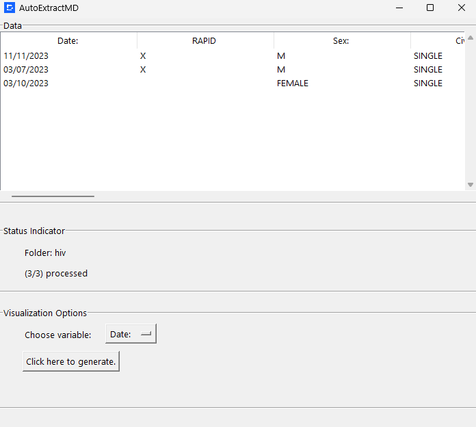

# AutoExtractMD: A Medical Form Extractor


## Description
AutoExtractMD is a program powered by Amazon Textract, Tkinter, and Pypandas that automatically scans and extract information, specifically, key-value pairs, from forms and records in jpg/png. Upon extraction, visualization in the form of a pie chart can be generated based on the user's chosen variable. Note that this does not accept PDFs, strictly images.

## Technologies Used


## Preparation
1. Make sure the following dependencies are installed in your device.
- decouple: `pip install decouple`
- boto3: `pip install boto3`
- tkinter: `pip install tkinter`
- pandas: `pip install tkinter`
- cryptography: `pip install cryptography`

2. Place all of your files in a main directory. Make inner folders for each records. For instance:
```
├── flu1
│   ├── file11.jpg
│   └── file12.jpg
├── flu2
│   ├── file21.jpg
│   ├── file22.jpg
│   └── file23.jpg
```
3. Generate your own access keys from AWS. Save them in a .env file.
```
aws_access_key_id=''
aws_secret_access_key=''
```
# GUI
A simple GUI is implemented for easy viewing.



## License
This project is licensed under the [Creative Commons Attribution-NonCommercial-ShareAlike (CC BY-NC-SA) 4.0 International License](https://creativecommons.org/licenses/by-nc-sa/4.0/).
